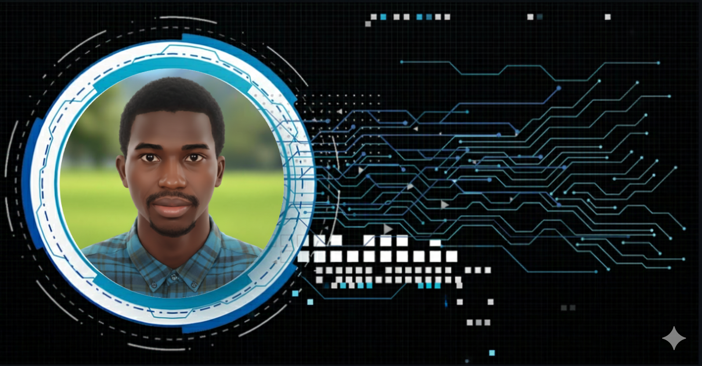

  
  # Hi 👋, I'm Dansoko Moussa
  ### Business Intelligence Engineer | Data Engineering | ERP Specialist
  
  

    
  

  

---

## 🚀 About Me

- 🎓 Engineering Student at **ESPRIT** specializing in **Business Intelligence & ERP**
- 💼 Co-founder of **PROXIMA Guinée** - Digital Solutions Startup
- 🌱 Currently mastering **Python**, **SAP ABAP & Fiori**, and **Advanced Data Analytics**
- 🏆 Certified **Oracle Data Platform Foundations Associate 2025**
- 📫 Reach me: **dansokomoussa42@gmail.com**
- 🌐 LinkedIn: [linkedin.com/in/dansokomoussa](https://www.linkedin.com/in/moussa-dansoko-a6a357172/)
---

## 🔗 Connect with Me

  
  
  
  

---

## 💻 Tech Stack

### Business Intelligence & Analytics

  
  
  
  
  

### Programming Languages

  
  
  
  
  
  

### Web Development

  
  
  
  
  
  
  

### Mobile Development

  
  

### Databases

  
  
  

### DevOps & Tools

  
  
  
  
  

### AI & Machine Learning

  
  

### Design & Multimedia

  
  
  

### IoT & Hardware

  

---

## 🌐 Languages

  
  

---

## 🔥 Featured Projects

### 🦠 COVID-19 Scientific Articles Classification & Analysis

> End-to-end AI system for classifying, analyzing, and retrieving COVID-19 scientific articles using NLP, Graph Neural Networks (GNN), and Graph-RAG technology. Features semantic search across scientific literature, automatic thematic clustering, intelligent article recommendations using Graph-RAG, and multi-source data aggregation.

**Technologies:** Python, PyTorch, NLP, Graph Neural Networks, Transformers, OCR, Graph-RAG

---

### 🏭 Supplier Sustainability MLOps Pipeline

> Complete MLOps pipeline for supplier sustainability classification with FastAPI, MLflow tracking, and Docker deployment. Implements automated model training, experiment tracking, performance monitoring, and RESTful API endpoints for real-time predictions.

**Technologies:** Python, FastAPI, MLflow, Docker, Scikit-learn, Pandas

---

### ☕ Spring Boot Microservice with DevOps Pipeline

> Java Spring Boot microservice with complete DevOps pipeline implementing testing, Docker containerization, Jenkins CI/CD automation, and Kubernetes deployment. Demonstrates modern microservices architecture with comprehensive DevOps practices.

**Technologies:** Java, Spring Boot, Jenkins, Docker, Kubernetes, Maven, PostgreSQL

---

### 🤖 Strategic AI Intelligence Dashboard
> AI-powered platform integrating GPT-4 for automatic analysis and classification of AI & Tech trends with multi-source data aggregation and executive dashboards.

---

### 🌱 Sustainable Optimization with SAP MM & PM
> BI/ERP project in agri-food industry integrating SAP for centralized industrial data management, CO₂ emissions tracking, energy optimization, and predictive maintenance.

---

### 📚 AppReader
> Modern web application for digital reading with smooth navigation, content search, and contemporary interface.

---

### 🌍 Ecotourism Web & Desktop Application
> Academic project promoting sustainable tourism with ecological destination management, interactive maps, user profiles, online bio shop, and educational library.

---

## 📊 GitHub Statistics

  
  

  

  

---

  
  ### 💡 "Innovation is not about saying yes to everything. It's about saying NO to all but the most crucial features."
  
  
  
  
  ---
  
  **⚡ Open to opportunities in BI, Data Engineering, and ERP projects worldwide!**
  

